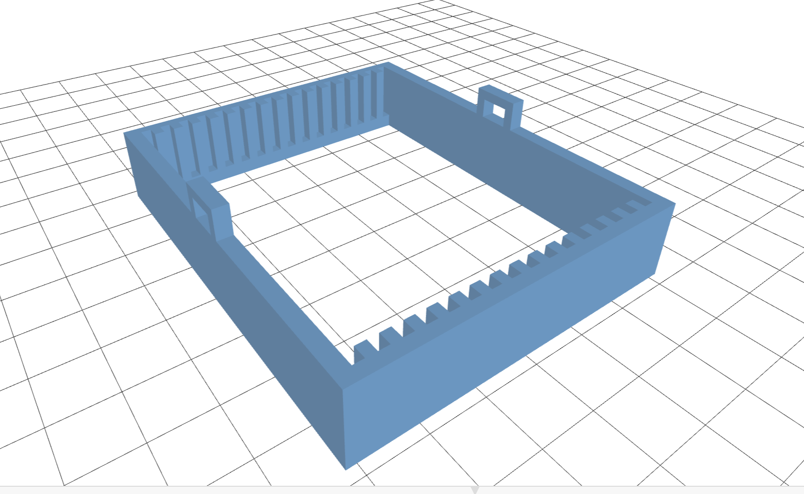
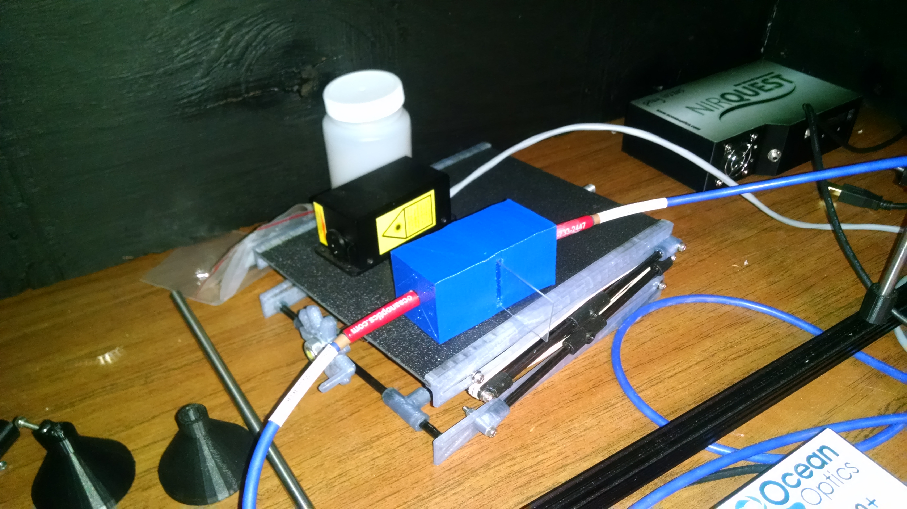
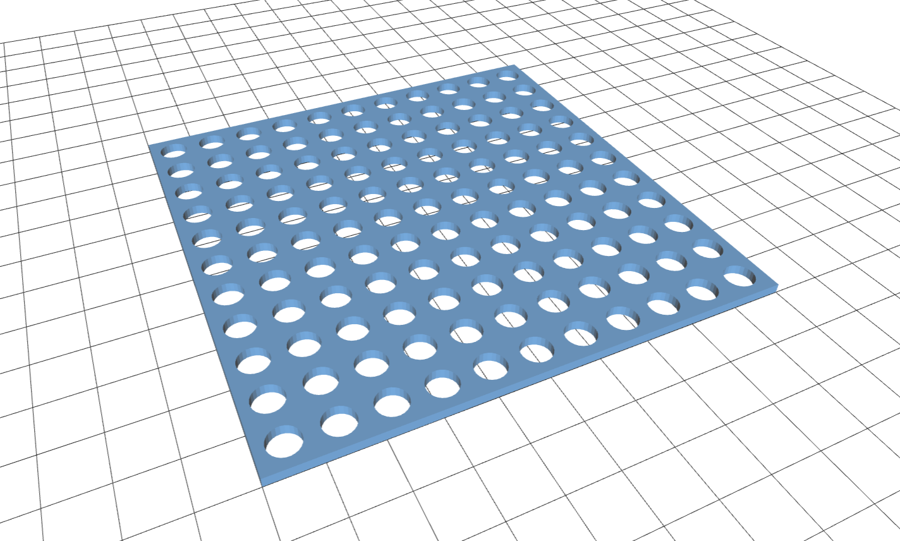
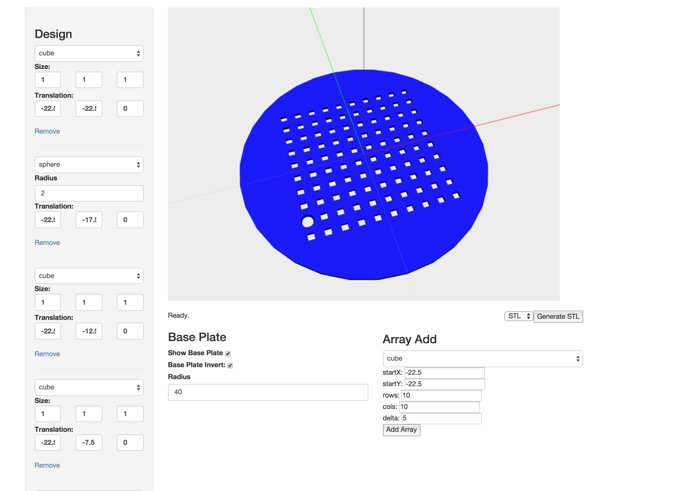

# Jephias Tools

Jephias Gwamuri, Lucas Wilder, Steven Helminen, Stuart Larsen, Pankaj Deshmukh

## Source

### Parametric Microscope Slide Holder

[http://3dprint.nih.gov/discover/3dpx-000746](http://3dprint.nih.gov/discover/3dpx-000746)

Handle: [http://www.thingiverse.com/thing:521814](http://www.thingiverse.com/thing:521814)

This is a parametric handle that is meant to go with my Parametric Microscope Slide Holder, which can be found here: http://www.thingiverse.com/thing:518915
.
Open the file up in Customizer, enter the number of slides to match the holder, and print it out!

Base: [http://www.thingiverse.com/thing:518915](http://www.thingiverse.com/thing:521814)

This is a fully customize-able microscope slide holder created for the class EE 4777 at Michigan Technological University. Enter in your slide dimensions and number of slides you want it to hold, then print away. Meant to be accompanied by http://www.thingiverse.com/thing:521814.

### 4in Wafer Holder

[4inch_Wafer_Holder.scad](4inch_Wafer_Holder.scad)

[NIS Circular Wafer Holder] (http://3dprint.nih.gov/discover/3dpx-000772)

4" inch diameter circular/4" side square wafer silicon wafer holder for clean room

### UV Vis Sample Stage

[UVSample.scad](UVSample.scad)

[NIS UV-Vis](http://3dprint.nih.gov/discover/3dpx-000775)

### Negative Shadow Masks

[http://3dprint.nih.gov/discover/3dpx-000747](http://3dprint.nih.gov/discover/3dpx-000747)

[http://www.thingiverse.com/thing:522349](http://www.thingiverse.com/thing:522349)

This is a contact shadow mask for use with a negative photo-resist (PR) during UV-lithography. It is used in micro-fabrication and its customize-able to get different feature shapes and sizes.

### Positive Shadow Mask

[http://3dprint.nih.gov/discover/3dpx-000752](http://3dprint.nih.gov/discover/3dpx-000752)

[http://www.thingiverse.com/thing:529208/#files](http://www.thingiverse.com/thing:529208/#files)

A fully customize-able shadow mask created for the class MY4777 at Michigan Technological University.
For use with a negative photo-resist (PR) during UV-lithography. It is used in micro-fabrication of solar cells and its customize-able to get different feature shapes and sizes.
Open it in Customizer to edit the dimensions of the shadow mask to your liking

### Shadow Mask Builder

A tool for building custom positive and negative shadow mask. Like customzer, but better!

Demo: [masker.herokuapp.com](http://masker.herokuapp.com/)

Code: [masker](http://github.com/c0nrad/masker)

## Directions

Download .stl files and print.

### Explanations

## Price

### Parametric Microscope Slide Holder
$50-$100
But we printed it for .40 cents.

99% savings.

### Mask
$750 Bilayer Mask
We can print for 2cents.
99.997% savings

### Sample Holder for UV Vis

specification for the holder in the website,http://oceanoptics.com/product/rph-reflection-probe-holders/

The cost is around 120 USD (RPH2) and 100 USD for RPH1

This is the cost of the holder. We can also sho the original from ocean optics which is for reflection measurements. Ours is for transmission measurements.

We print for about 35 cents.
